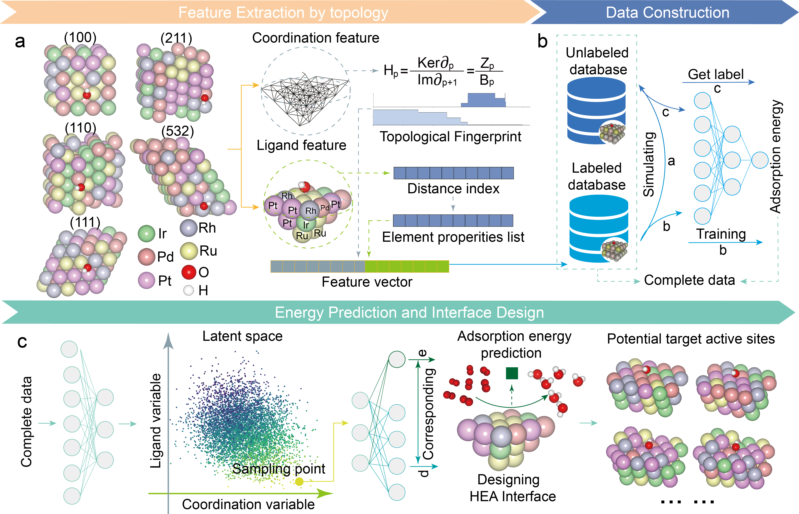

# PGH-VAEs

<div align='center'>
 
<!-- [](https://www.google.com/) -->
[](https://opensource.org/licenses/MIT)

</div>

**Title** - PGH-VAEs: Inverse Design of Catalytic Active Sites via Interpretable Topology-Based Deep Generative Models

**Authors** - Bingxu Wang, Shisheng Zheng, Jie Wu, Jingyan Li and Feng Pan

---

## Table of Contents

- [PGH-VAEs](#PGH-VAEs)
  - [Table of Contents](#table-of-contents)
  - [Introduction](#introduction)
  - [Model Architecture](#model-architecture)
  - [Getting Started](#getting-started)
    - [Prerequisites](#prerequisites)
  - [Datasets](#Datasets)
  - [Model Files](#Model-Files)
  - [License](#license)
  - [Citation](#citation)
  - [Acknowledgements](#acknowledgements)

---

## Introduction
This work present a persistent GLMY homology-based variational autoencoder framework (PGH-VAEs) designed to enable interpretable inverse design of catalytic active sites. PGH-VAEs integrate advanced topological algebraic analysis to mathematically quantify the three-dimensional structural sensitivity of active sites and establish intrinsic correlations with their adsorption properties. Using high-entropy alloys as a complex test case, PGH-VAEs demonstrate how the multi-channel encoding framework captures coordination and ligand effects at active sites, shaping the latent space of the generative model and significantly influencing the adsorption energies of key species. Building on the inverse design outcomes of PGH-VAEs, we propose strategies to optimize the composition and facet structures of high-entropy alloys to maximize the proportion of ideal active sites. This framework seamlessly combines catalyst design with topological analysis, offering a novel pathway for machine intelligence-driven development of efficient catalysts across diverse systems.

> **Keywords**: Persistent GLMY homology, Deep learning Inverse design, Interpretability, Heterogeneous catalysis.

## Model Architecture
Schematic illustration of the overall PGH-VAEs framework is shown in below.



Further explain the details in the [paper](https://github.com/PKUsam2023/PGH-VAEs), providing context and additional information about the architecture and its components.

## Getting Started

### Prerequisites

The code in this repo has been tested with the following software versions:
- Python>=3.7.0
- torch>=1.13.1
- numpy>=1.21.5
- scikit-learn>=0.24.2
- matplotlib>=3.3.4

The installation can be done quickly with the following statement.
```
pip install -r requirements.txt
```

We recommend using the Anaconda Python distribution, which is available for Windows, MacOS, and Linux. Installation for all required packages (listed above) has been tested using the standard instructions from the providers of each package.

## Datasets

The data for path complexes constructed for different HEA catalysts calculated by DFT is located in the directory
```
./get_data/rawfeature/
```
The data for path complexes constructed for simulation-generated different HEA catalysts is located in the directory
```
./get_data/rawfeature_simu/
```
The data for ligand features and coordination features of different HEA catalysts calculated by DFT, is available in the directory
```
./get_data/teacher_data/
```
The data for ligand features and coordination features of simulation-generated different HEA catalysts, is available in the directory
```
./get_data/student_data/
```
The data for ligand features and coordination features of simulation-generated different HEA catalysts for the VAE training, is available in the directory
```
./PathVAEs/fornn/
```
To obtain full data, please contact 2101212695@stu.pku.edu.cn 


## Model Files

This repo should contain the following files:
- 1 ./get_data/get_feature.py - The code employed in the retrieval of data pertains to the path complexes derived from DFT calculations for various HEA catalysts.
- 2 ./get_data/get_more_simulation.py - The code utilized for acquiring data corresponds to the path complexes generated through simulations for distinct HEA catalysts.
- 3 ./get_data/get_topo_feature.py - The code implemented is designed for the extraction of persistent path homology concerning diverse HEA catalysts. This encompasses catalysts for which calculations were performed using DFT, as well as those generated through simulations.
- 4 ./get_data/Digraph.py - The method code for computing persistent path homology for path complexes.
- 5 ./GBRT/getdata.py - The code employed for the data for the inputs to the GBRT model.
- 6 ./GBRT/GBRT.py - The main code for GBRT model.
- 7 ./GBRT/model.py - The code for GBRT model.
- 8 ./GBRT/model_test.py - The code employed for acquiring the labels of simulation-generated different HEA catalysts by trained GBRT.
- 9 ./PathVAEs/getdata.py - Method code for inputting data to PathVAEs.
- 10 ./PathVAEs/the_nn.py - The code for PathVAEs with semi-supervised learning.
- 11 ./latent_space/getdata.py - Method code for inputting data to PathVAEs.
- 12 ./latent_space/get_100_result.py - The code employed to get the latent spaces of PathVAEs and the high potential HEA catalyst structures.

If you find any bugs or have questions, please contact 2101212695@stu.pku.edu.cn

## License

This project is licensed under the MIT License - see the [LICENSE](LICENSE) file for details.

---

## Citation

If you use this code or the pre-trained models in your work, please cite our work. 
- Bingxu Wang, Shisheng Zheng, Jie Wu, Jingyan Li and Feng Pan. "PGH-VAEs: Inverse Design of Catalytic Active Sites via Interpretable Topology-Based Deep Generative Models"
